# Biblioteca Digital API

API para gestionar una biblioteca digital, que permite el manejo de libros, autores, bibliotecarios, lectores y préstamos, así como la carga y almacenamiento de imágenes en Amazon S3.

## Ejecución del proyecto

### Pasos previos a la ejecución

Antes de ejecutar el código, asegúrate de cumplir con los siguientes requisitos:

1. **Base de datos**: crea una base de datos en MongoDB llamada `biblioteca_digital`.
   - Dentro de esta base de datos, crea las siguientes colecciones:
     - `Libro`
     - `Autor`
     - `Bibliotecario`
     - `Lector`
     - `Prestamo`

2. **Bucket de Amazon S3**: crea un bucket en S3 con el nombre `sistemas-distribuidos-upiiz-DAMOPK`.
   - Configura las credenciales de acceso a AWS en tu entorno para permitir que la API pueda realizar operaciones en este bucket.

### Pruebas
respuesta de creacion con exito de un autor en la api
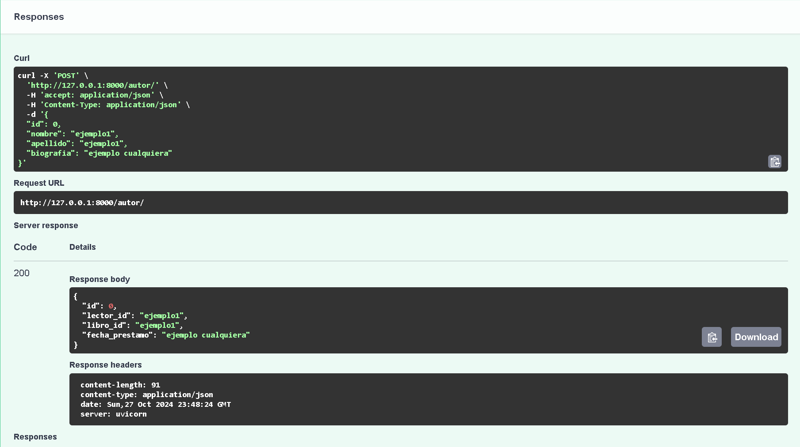
respuesta de creacion con exito de un autor en la base de datos
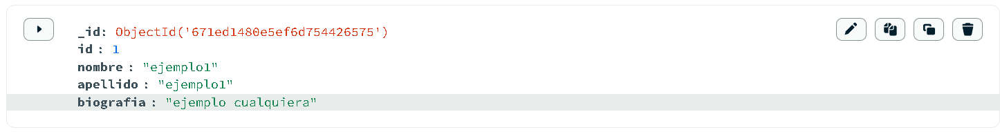

respuesta de creacion con exito de un bibliotecario en la api
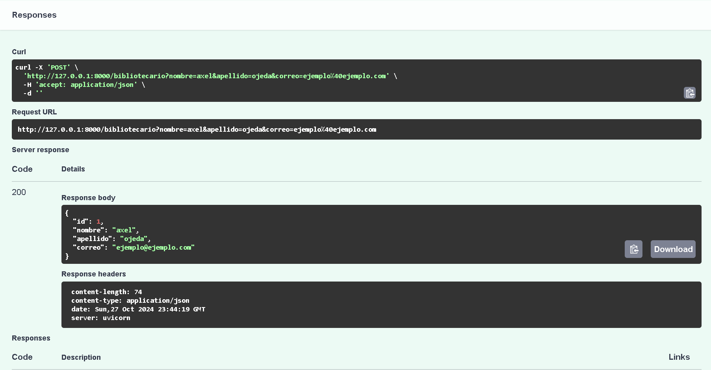
respuesta de creacion con exito de un bibliotecario en la base de datos

respuesta de creacion con exito de un lector en la api
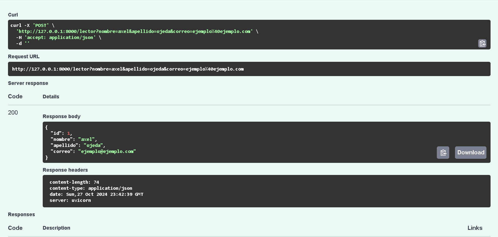
respuesta de creacion con exito de un lector en la base de datos
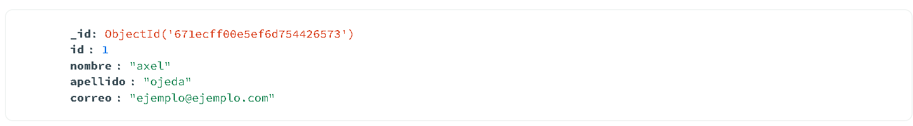

respuesta de creacion con exito de un libro en la api
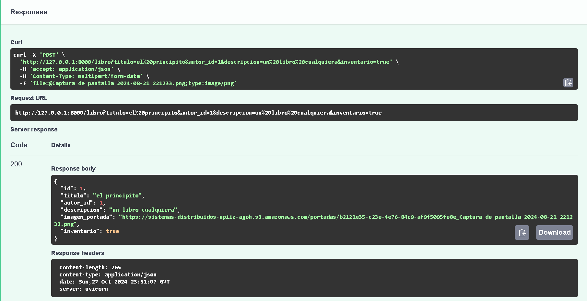
respuesta de creacion con exito de un libro en la base de datos
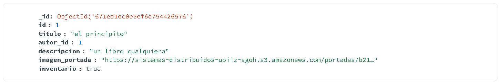
respuesta de creacion con exito de un libro en AWS
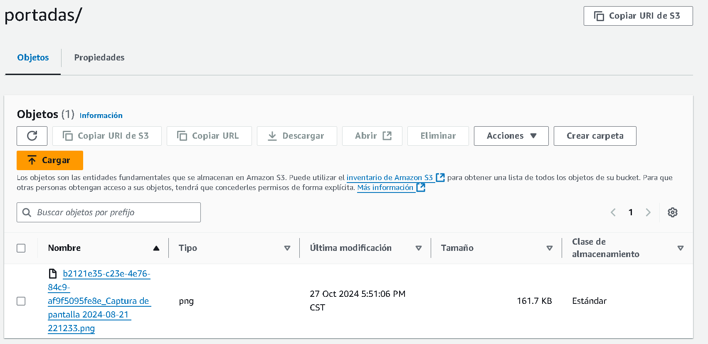

respuesta de creacion con exito de un prestamo en la api
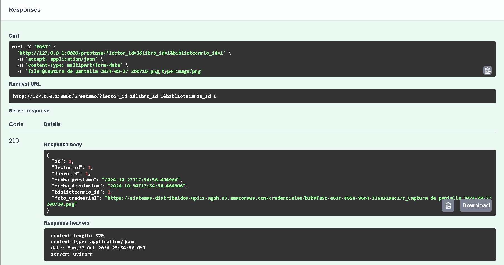
respuesta de creacion con exito de un prestamo en la base de datos
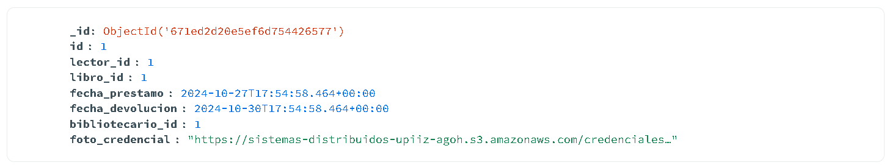
respuesta de creacion con exito de un prestamo en AWS
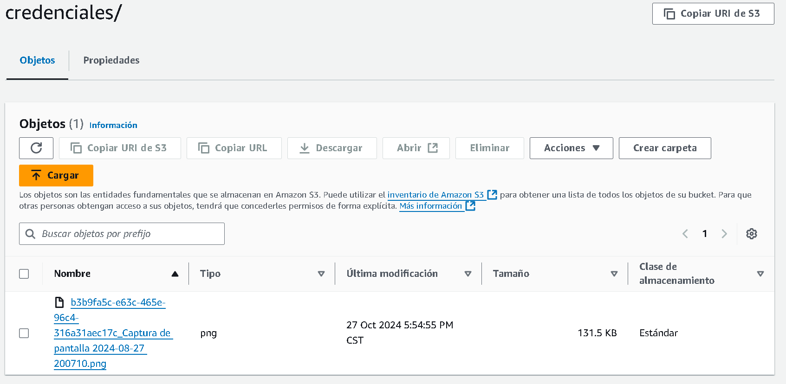
